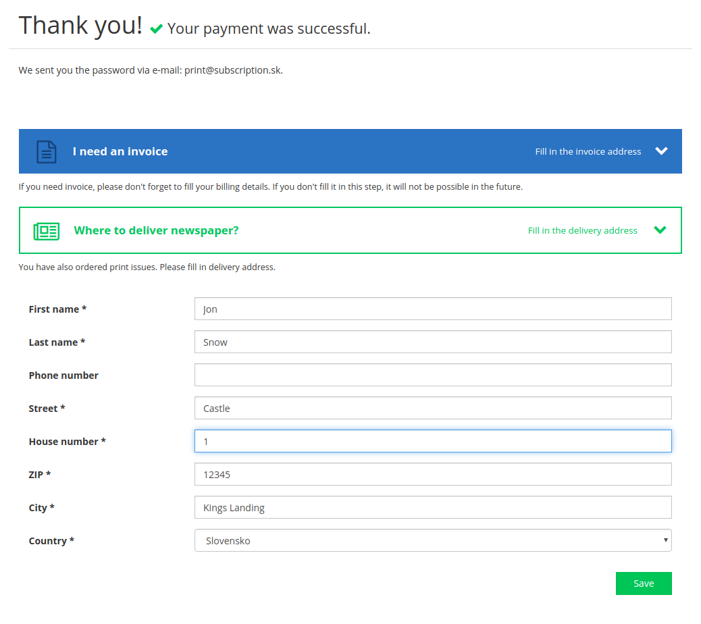
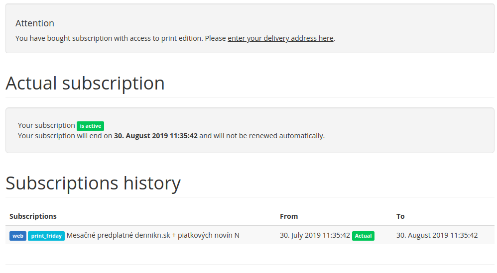
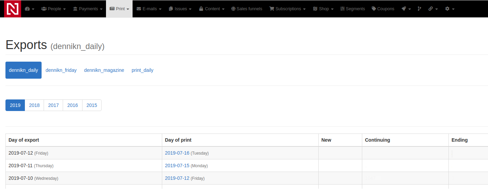
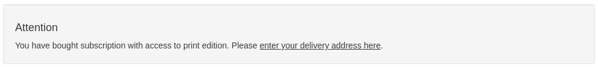
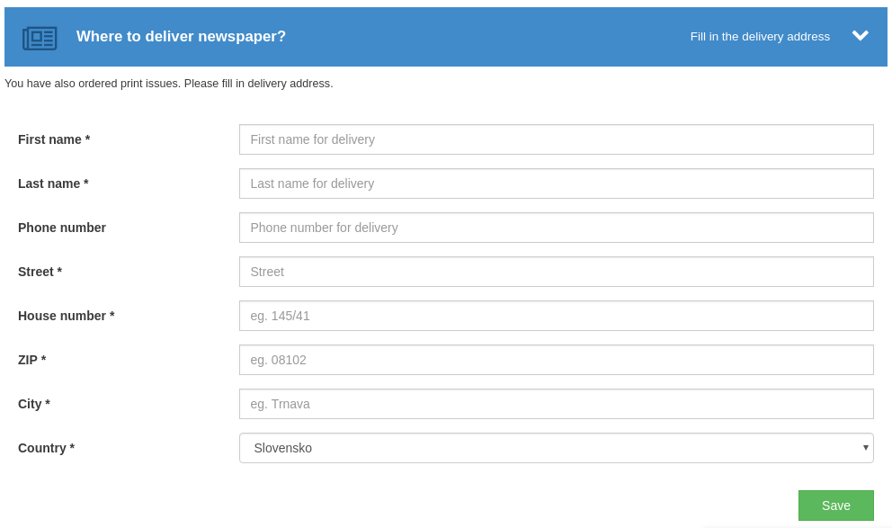
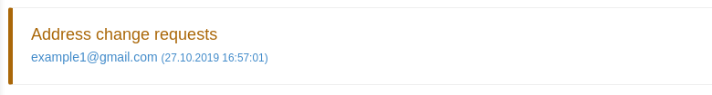
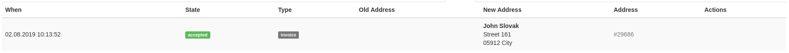
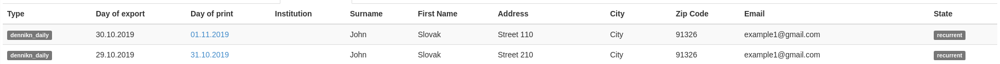

# CRM Print Module

The purpose of *Print module* is to give you ability to generate exports of users who should receive print version of your newspaper/magazine, keep track of which issues the user got and give you ability to create your own module on top of *Print module* to integrate with your print delivery provider.

## Installing module

We recommend using Composer for installation and update management.

```shell
composer require remp/crm-print-module
```

### Enabling module

Add installed extension to your `app/config/config.neon` file.

```neon
extensions:
	- Crm\PrintModule\DI\PrintModuleExtension
```

Run service commands to generate CRM internals:

```
php bin/command.php phinx:migrate
php bin/command.php user:generate_access
php bin/command.php api:generate_access
php bin/command.php application:seed
```

## Configuration

### Directory

Default directory for exports, is APP_ROOT/content/export. Directory is created automatically with first upload.

You can use other buckets for uploads, but you need to define them in your config file `app/config/config.neon`:

```neon
services:	
	# ...
	# fileManager extension - example uploads
	exampleExportsFileSystem: League\Flysystem\Filesystem(League\Flysystem\Adapter\Local('%appDir%/../content/examples_exports'))
	applicationMountManager:
		setup:
			- mountFilesystem('exampleExports', @exampleExportsFileSystem)
```

## Using print module

### Frontend

Print module adds `print` address type. This address type should be use for deliveries of your newspaper/magazines.

Module also adds new *content access* to the CRM called `print`. You can add this *content access* to selected *subscription types* and let your customers buy them. If user buys subscription with access to `print`, CRM will ask user to enter delivery (`print`) address after successful payment.



If for some reason user doesn't enter the address, she's reminded by notification to enter the missing address on every page of customer zone. Administrators are reminded by the list of all people with active print subscription with missing `print` address by widget in CRM admin.

 

You can always replace this widget with your own implementation by overriding the default widget in your custom module:

```php
public function registerWidgets(\Crm\ApplicationModule\Widget\WidgetManagerInterface $widgetManager)
{
    // ...
    $widgetManager->overrideWidget(
        'frontend.layout.top',
        $this->getInstance(\Crm\PrintModule\Components\EnterAddressWidget::class),
        $this->getInstance(\Crm\FooModule\Components\EnterAddressWidget::class),
        100
    );
    // ...
}
```

### Backend

As every publisher works with different delivery partner which requires data in different format, we only prepared demo command to generate CSV with list of print subscribers that should receive a print edition.

It's recommended for you to create your own implementation of export command in your custom module based on this one altered to match your needs.

The command uses two main concepts:

* *DataSource*. This should return query containing all the subscriptions that could be used to generate CSV. In our [demo data source](./src/app/modules/PrintModule/model/Export/DailyExportDataSource.php) we select all `print` subscriptions.
* *View*. This is component handling how the subscriptions are actually displayed (exported) into the CSV file. Here you can define what columns the export should have and the actual values with possibility to format them based on your needs. See [demo view](./src/app/modules/PrintModule/model/Export/DailyExportView.php) to see how the CSV is created.

Command is defined in a way that export is generated two working days before the delivery - this is industry standard in our area. If your flow differs, feel free to alter this in your implementation.

You can also see, that command uses `print_daily` as a *key* for *export criteria*. This is to differentiate between multiple exports as one publisher might have daily delivery of one newspaper and monthly delivery of some magazine. This *key* is identifying which export is being used. You should therefore have different generation commands for different exports.

The exporting engine is automatically handling print status for every print subscriber. Each generation it flags every customer to give you information whether it's a:

* *new* subscriber - she'll get the first edition
* *recurrent* subscriber - she was receiving the newspaper before (e.g. the day before) and she should receive them also today
* *removed* subscriber - she was receiving the newspaper before (e.g. the day before) and she is not supposed to get the newspaper today.

These flags help to some delivery partners which don't need full list of subscribers every day but they require incremental changes of people who should be added to the list / removed from the list.

Once generated, you can see and download the export in the CRM admin (`/print/print-subscriptions-admin/`:



## Components

**EnterAddressWidget**

Simple widget showing warning with missing address.



[Source code](https://github.com/remp2020/crm-print-module/blob/93ebdc8168a28f5bd5e754582dae60e9159d1036/src/components/EnterAddressWidget/EnterAddressWidget.php#L1)

[How to use](https://github.com/remp2020/crm-print-module/blob/93ebdc8168a28f5bd5e754582dae60e9159d1036/src/PrintModule.php#L91)

**PaymentSuccessPrintWidget**

Widget on subscription success page with address form.



[Source code](https://github.com/remp2020/crm-print-module/blob/93ebdc8168a28f5bd5e754582dae60e9159d1036/src/components/PaymentSuccessPrintWidget/PaymentSuccessPrintWidget.php#L1)

[How to use](https://github.com/remp2020/crm-print-module/blob/93ebdc8168a28f5bd5e754582dae60e9159d1036/src/PrintModule.php#L86)

**RequestNotification**

Address change request list widget.



[Source code](https://github.com/remp2020/crm-print-module/blob/93ebdc8168a28f5bd5e754582dae60e9159d1036/src/components/RequestsNotification/RequestNotification.php#L1)

[How to use](https://github.com/remp2020/crm-print-module/blob/93ebdc8168a28f5bd5e754582dae60e9159d1036/src/PrintModule.php#L81)

**UserChangeAddressRequests**

Listing witget with address change requests.



[Source code](https://github.com/remp2020/crm-print-module/blob/93ebdc8168a28f5bd5e754582dae60e9159d1036/src/components/UserChangeAddressRequests/UserChangeAddressRequests.php#L1)

[How to use](https://github.com/remp2020/crm-print-module/blob/93ebdc8168a28f5bd5e754582dae60e9159d1036/src/PrintModule.php#L76)

**UserPrintExport**

User detail print export lising widget.



[Source code](https://github.com/remp2020/crm-print-module/blob/93ebdc8168a28f5bd5e754582dae60e9159d1036/src/components/UserPrintExport/UserPrintExport.php#L1)

[How to use](https://github.com/remp2020/crm-print-module/blob/93ebdc8168a28f5bd5e754582dae60e9159d1036/src/PrintModule.php#L71)


